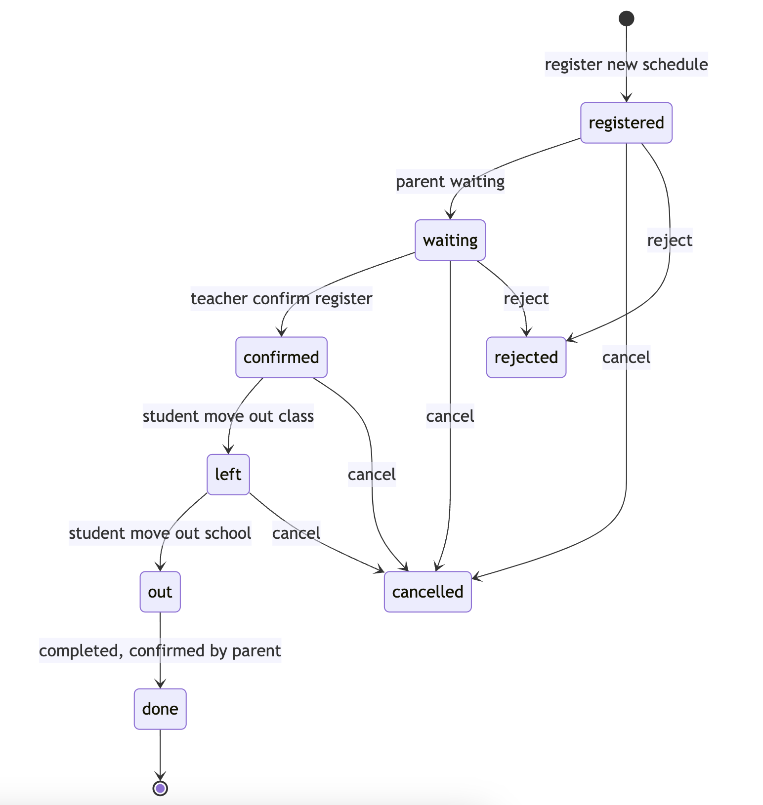

# skool-mn

## Overview
Coding Challenge

## Table of Contents
- [Description Status](#status)
- [Getting Started](#getting-started)
  - [Prerequisites](#prerequisites)
  - [Installation](#installation)
- [Usage](#usage)
- [Configuration](#configuration)
- [Contributing](#contributing)

## State machine


## Getting Started
### Installation

### Prerequisites
- Golang 19+
- MySQL (or provide details if using a different database)
- Docker
- [golang-migrate](https://github.com/golang-migrate/migrate)
- [Makefile GNU](https://www.gnu.org/software/make/manual/make.html)

## Usage
### Initialize database
Use the following command to init an instance database, and create tables
```bash
make init-db
make migrate-up
```
- MySQL as our database, the schema will be stored in [migrations](migrations)
- We use [migrate](#https://github.com/golang-migrate/migrate/blob/master/GETTING_STARTED.md) read migrations from sources and apply them in correct order to a database.

### Migration database
[Migration Contents](MIGRATIONS.md)

### Starting the Server
To start the SampleService Server, use the following command:
```bash
go run main.go server
```
- The service will be available at http://localhost:9090
- Swagger docs: http://localhost:9090/swagger/index.html#/

### API Endpoints
- `GET /parents/:id/students`: List all students of parent, base on parent_id
- `POST /parents/register`: Register a new schedule pick up
```json
{
  "parent_id": "1BX7NAJ",
  "student_ids": [
    "17E8ZIN",
    "1YZB7F4"
  ],
  "register_time": "2024-01-20 16:00:00"
}
```
- `PUT /parents/registers/:id/waiting`: Confirm that parents is ready for pik up
- `PUT /parents/registers/:id/cancel`: Confirm that parents want to cancel register
- `PUT /parents/registers/{id}/confirm`: Confirm that parents have completed pick up
- `PUT /teachers/registers/{id}/confirm`: Confirm that their student has left the class
- `PUT /teachers/registers/{id}/reject`: Confirm that this teacher want to reject the register schedule
- `PUT /teachers/registers/{id}/reject`: Confirm that this teacher want to reject the register schedule
- `PUT /students/:id/leave`: Confirm that this student left this class
- `PUT /students/:id/out`: Confirm that this student left this school

## Configuration

## Contributing
We welcome contributions. To contribute to this project, please follow these steps:
```bash
- Fork the repository
- Create a new branch for your feature: git checkout -b feature/your-feature-name
- Commit your changes: git commit -m 'Added a new feature'
- Push to the branch: git push origin feature/your-feature-name
- Create a pull request
```
Please follow our code of conduct and coding style guidelines.